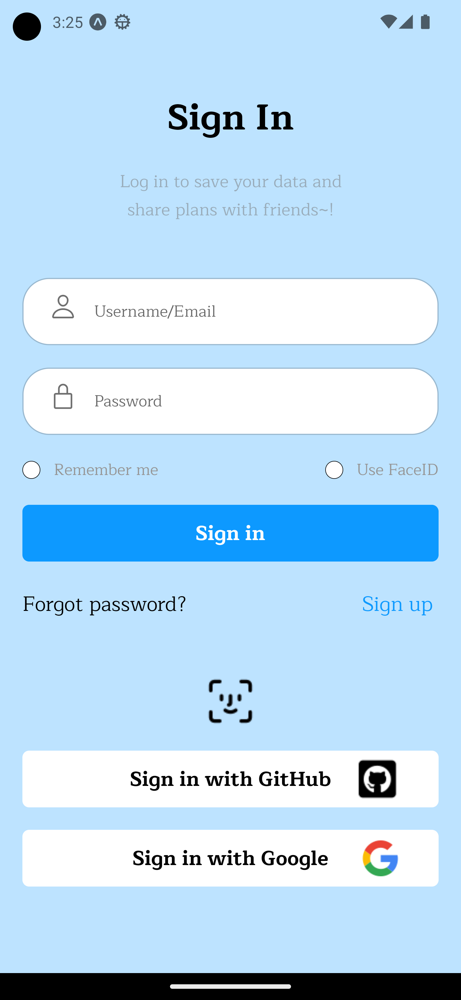
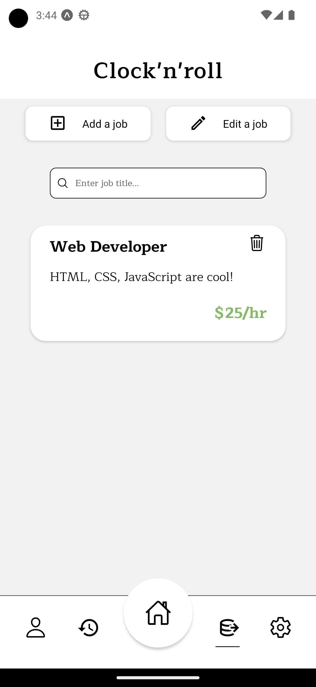
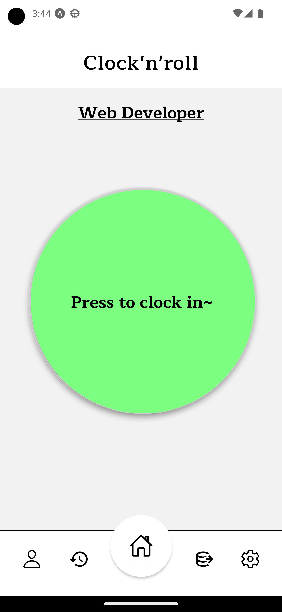
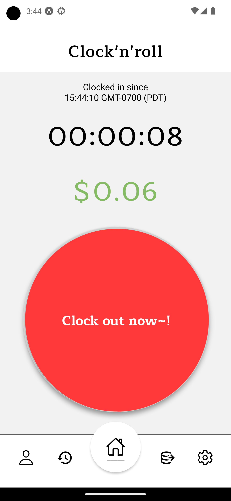

# Clock'n'roll

Clock'n'roll is a mobile app that helps you keep track of your hours by clocking in & out of a job that you create, simulating the 'semi-real' experience of the real clock-in clock-out device in the workplace.

## Progress

Current status of the project is still a work in progress as some of the features are still under development. Here is a list of features that will be implemented in the future:

- [ ] Save work history to Firebase
- [ ] Authenticate with GitHub & Google APIs
- [ ] Utilize biometrics (FaceID, Fingerprint) for authentications
- [ ] Job query/filters
- [ ] Export data as printable format
- [ ] Share/request/create job(s) for others and yourself
- [ ] and many more if I can think of :3

Here is a list of features that have been implemented:

- [X] Authentication
- [X] Cloud data backup/save
- [X] Basic clock in/out feature and wage calculations
- [X] To-do list

## Technologies Used

`React Native`:
  - UI framework to develop responsive mobile applications.

`JavaScript` & `CSS`:
  - Programming language and stylesheet for React Native.

`Firebase`:
  - Authentication and database storage.

## Screenshots

- Here are some screenshots from the app:

#### Login screen

#### Jobs list screen

#### Clock-in screen

#### Details screen

## License

MIT License [here](./LICENSE).
